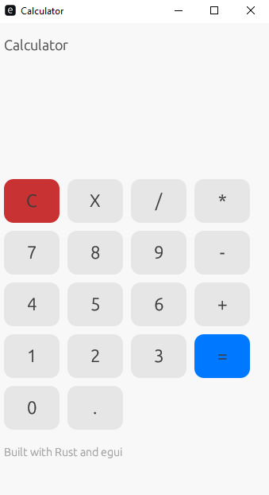

# Rust Calculator with Egui

A simple **desktop calculator** built in **Rust** using [`egui`](https://crates.io/crates/egui) and [`eframe`](https://crates.io/crates/eframe).  
It supports basic arithmetic operations and provides a clean, modern GUI.

---

## Features

- Basic arithmetic: `+`, `-`, `*`, `/`
- Clear (`C`) and backspace (`X`) functionality
- Real-time display of input and result
- Simple, responsive button grid
- Built with Rust and `egui` for cross-platform desktop use

---

## Screenshots

  
*Example layout of the calculator*

---

## Installation

Make sure you have **Rust** installed. If not, install from [rustup.rs](https://rustup.rs/).

1. Clone the repository:

```bash
git clone https://github.com/Nirajan14/rust_calculator.git
